# Contact Line Advection using the Level Set Method

This software uses a Finite Volume based discretization of the level set equation to solve for the evolution of an interface being in contact with the domain boundary. The present implementation has been used to produce the results in the manuscript [1], which has been submitted to the Proceedings in Applied Mathematics and Mechanics (https://onlinelibrary.wiley.com/journal/16177061). An additional publication concerning the contact line advection with the Volume-of-Fluid method is in preparation [4].

Within the level set method (see, e.g. [5]), the interface is represented as the zero contour of some smooth function, i.e. the interface at time t is given as the set

\f[ \Sigma(t) = \{x \in \Omega: \phi(t,x) = 0 \}. \f]

The interface is advected by a prescribed velocity field v according to the evolution equation

\f[ \partial_t \phi + v \cdot \nabla \phi = 0. \f]

This problem emerges from the discretization of continuum models for dynamic wetting, where the velocity field is a solution of the two-phase Navier Stokes equations. Here we are interested in the time evolution of both the *contact line*, i.e. the line of contact of the interface and the domain boundary, and the *contact angle* which is the angle of intersection between the interface and the boundary. In the Journal publications [2] and [3], we proved a fundamental kinematic relationship between the rate of change of the contact angle and the transporting velocity field. The kinematic evolution equation serves as a reference to validate the numerical solution of the level set equation in terms of the contact line position and the contact angle. 

The method is capable of solving the transport equation in both two and three dimensions, while the automatic evaluation of the contact angle over time is currently only implemented for the two-dimensional case.

### Authors of the software
* Mathis Fricke (fricke@mma.tu-darmstadt.de), Mathematical Modeling and Analysis, TU Darmstadt, Germany
* Tomislav Marić (maric@mma.tu-darmstadt.de), Mathematical Modeling and Analysis, TU Darmstadt, Germany
* Aleksandar Vučković (aleksandar.vuckovic@stud.tu-darmstadt.de), Student at Mathematical Modeling and Analysis, TU Darmstadt, Germany

### References
* [1] M. Fricke, T. Marić and D. Bothe: Contact Line Advection using the Level Set Method, Proceedings in Applied Mathematics and Mechanics, submitted
* [2] M. Fricke, M. Köhne and D. Bothe: A Kinematic Evolution Equation for the Dynamic Contact Angle and some Consequences. Physica D: Nonlinear Phenomena, 394:26–43, https://doi.org/10.1016/j.physd.2019.01.008 (2019)
* [3] M. Fricke, M. Köhne and D. Bothe: On the Kinematics of Contact Line Motion, Proceedings in Applied Mathematics and Mechanics, https://doi.org/10.1002/pamm.201800451 (2018)
* [4] M. Fricke, T. Marić and D. Bothe: Contact Line Advection using the Volume-of-Fluid Method, in preparation
* [5] Y. Giga: Surface Evolution Equations: A Level set Approach, in: Monographs in Mathematics, vol. 99, Birkhäuser, Basel, http://dx.doi.org/10.1007/3-7643-7391-1 (2006)

Note that [2] is also available on the arXiv preprint server, see https://arxiv.org/abs/1810.00830.

# Installation

### Dependencies
The software is most easily compiled on Unix system using the GNU compiler. It has also been tested successfully on Windows 10 using the Cygwin project (https://www.cygwin.com/).

* g++ (GCC) 6.1
* make
* ParaView for Visualization

In order to rebuild the documentation from the source code, one further needs the software *doxygen* which is available for all platforms (see www.doxygen.nl).

### Compiling the software

On a Unix system enter the src/ directory and run make:

    cd src/
    make

# Usage

To run the program, execute

    ./finiteVolumes

Within the same directory, you will find the files contactAngle.csv and position.csv. The first column represents the simulation time, the second is the actual value and the third is the reference value.
You will find a folder named data/ as well. It will contain the binary files of the field, its level set value, velocity field and the XMF file necessary to visualize everything in Paraview (version 5.5 and higher).

## Inputfile

All parameters in the Inputfile need to be set in order for the program to work correctly.
The order of the parameters is NOT interchangeable.
The physical parameters have arbitrary units.
They are as follows:

Variable name | Description
---------------|-----------
numX, numY, numZ| Number of cells in the given direction
lenX, lenY, lenZ| Length of simulation plane in the given direction
time | The simulation time
CFL  | Courant-Friedrichs-Lewy-number
writestepsFraction | Fraction of total timesteps that will be written to disk|
writeField| Whether to write the level set field binary files to disk. The files contactAngle.csv and position.csv are always written (see below)
v0, c1, c2, field |  The field and its parameters. For the navier field all three parameters are relevant, but for the shear field, c1 and c2 are ignored and only the value of v0 matters.
centerX, centerY, centerZ | The initial center of the droplet.
expcpX, expcpY, expcpZ, expAngle | The expected coordinates for the initial contact point and the expected initial contact angle. Those are used for the reference solutions.
trackedContactPoint | Whether to track the left or right contact point. Only applicable in 2D.

### Implementation

The numerical method is based on an Explicit Euler Finite Volume Method on a regular cartesian grid (xxx). The program is structured into six files.

File name  | Description
----------------------|------------------
main.cpp | Reads the inputfile and handles the top-level loop which evolves the field with time.
Field.cpp/hpp | The fundamental field class. Each instance of field represents an equidistant grid of any type parameter.
LevelSet.cpp/hpp | This class extends Field, instantiated with "double" as its type parameter and obviously represents the levelset field.  It is contains most of the important methods such as \ref LevelSet::calculateNextTimestep "calculatedNextTimestep" and \ref LevelSet::getContactAngle "getContactAngle". An object of class LevelSet is instantiated at the beginning within the main() function.
VelocityField.cpp/hpp | An object of class VelocityField represents a chosen velocity field. It is aware of its parameters type (for example whether it is a shear field with v0 = 2) and the domain it is applicable on.
velocityFields.cpp/hpp | This is a library that contains the definitions of the velocity fields.
vecMath3D.cpp/hpp |  This is a library of operator overloads and functions for vector analysis.

### Adding a new velocity field

To add a new velocity field, add it and its Jacobian matrix to the files velocityFields.cpp and .hpp. Next, add the appropriate if-statement to the VelocityField::at member function.
# Examples

## Navier slip type field (src/testcases/navier)
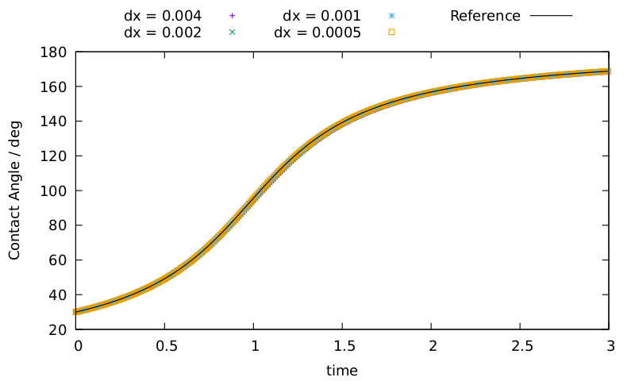

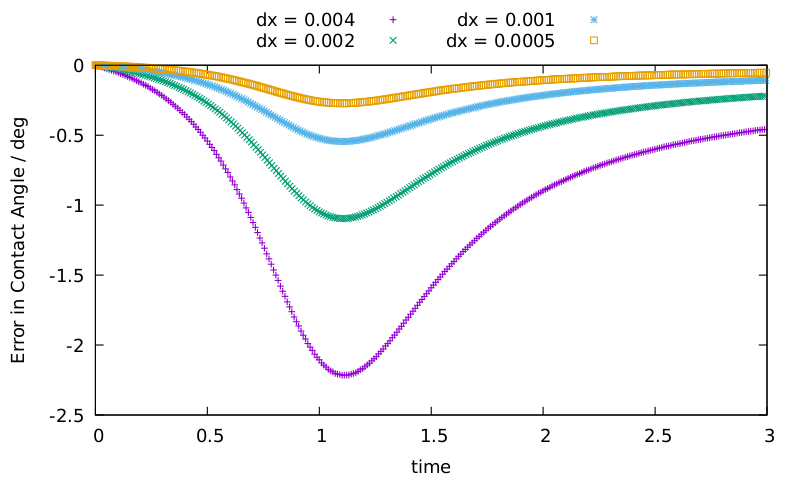

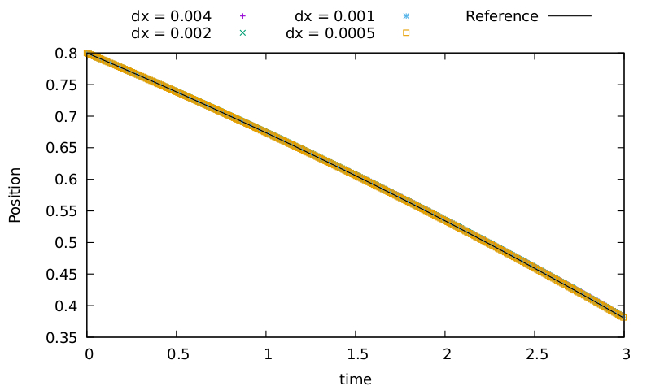

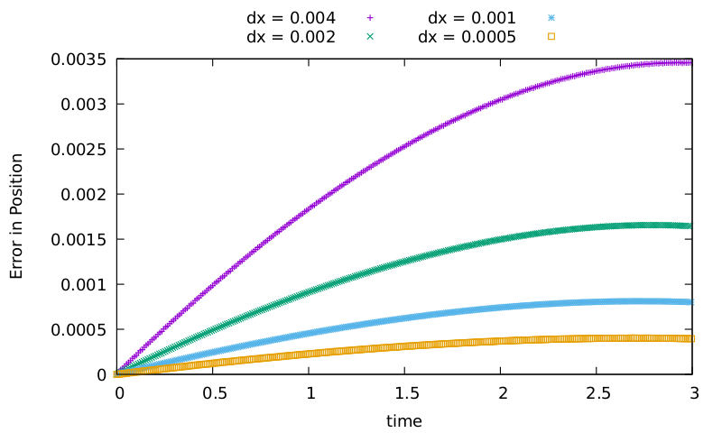

## Vortex-in-a-box field (src/testcases/shear)
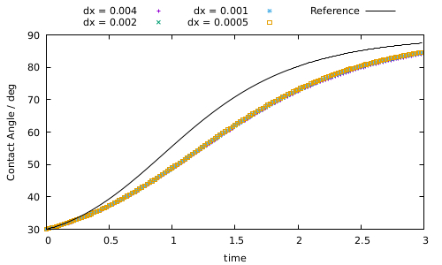

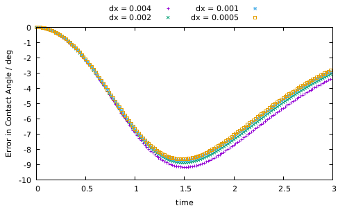

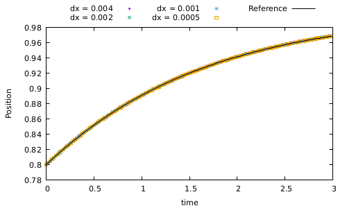

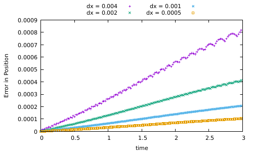

## Time-dependent field (src/testcases/timeDependentNavier)
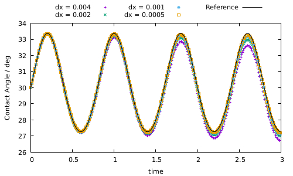

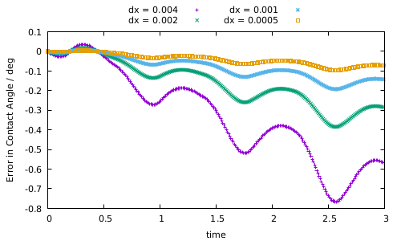

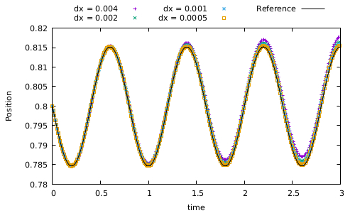

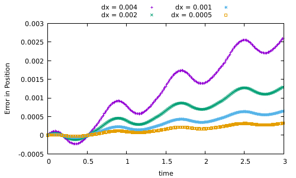

# Further information
(xxx doxygen, contact to us, sfb info, licence?)

